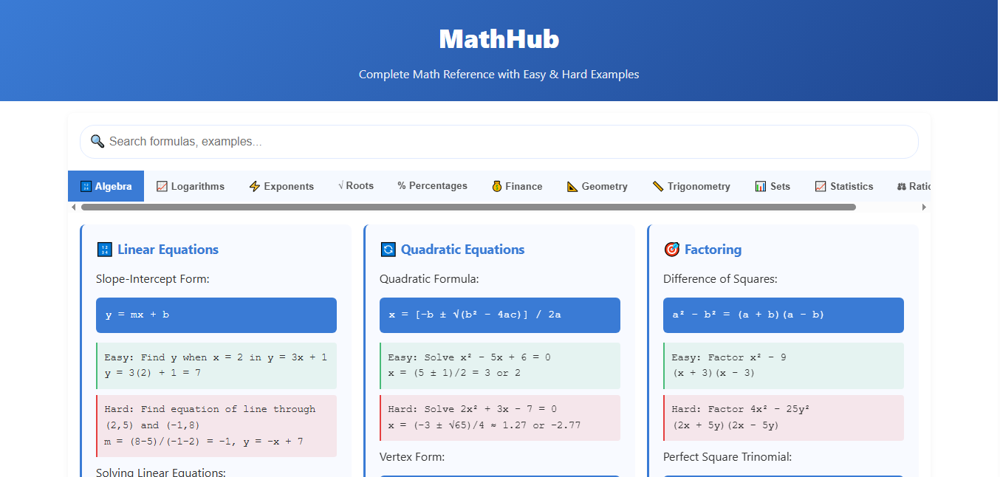

# Math Formula Reference 🧮  
### by Ali Zain Al-Aabdeen  

  
  

  

A **mobile-friendly** math formula cheatsheet with:  
- 🔍 Instant search  
- 📱 Responsive design  
- 📚 Organized formulas (Algebra/Geometry/Calculus)  

## 🚀 Features  
| Feature | Description |  
|---------|-------------|  
| **Tab System** | Switch between math categories |  
| **Live Search** | Filters formulas as you type |  

## 🔗 Live Demo  
➡️ **[https://ali-zain-al-aabdeen.github.io](https://ali-zain-al-aabdeen.github.io)**  

## 📜 License  
MIT © [Ali Zain Al-Aabdeen](https://github.com/Ali-Zain-al-Aabdeen)  
